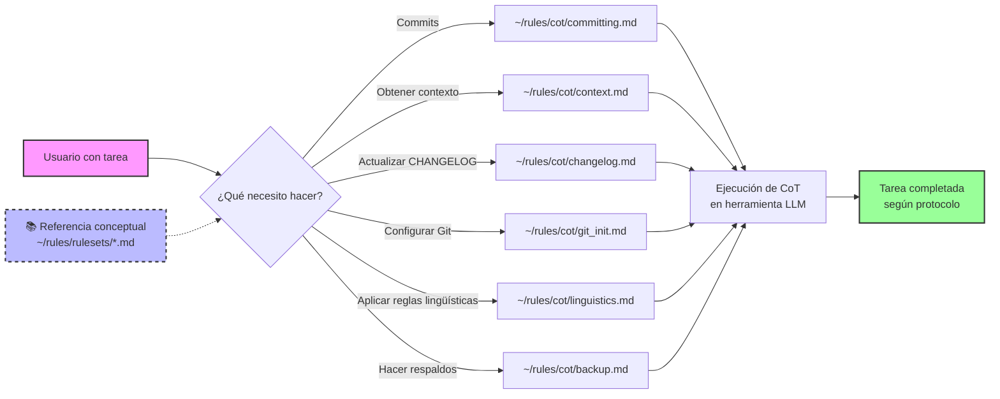
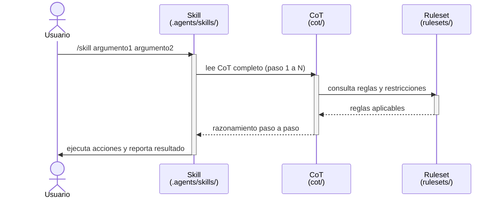

# Reglas técnicas: prompts y CoT para acelerar el contexto de los LLM

*Última modificación: 27 de marzo de 2026, 23:26 (CST)*

[](https://www.gnu.org/licenses/gpl-3.0)
[](http://commonmark.org)
[-green.svg)](https://es.wikipedia.org/wiki/Espa%C3%B1ol_mexicano)
[](./cot/)
[](./.agents/skills/)
[](./rulesets/)

## Definiciones rápidas

- *Prompt*: instrucción o contexto que le das al modelo para indicarle qué hacer, con qué tono y bajo qué restricciones.
- CoT (*Chain-of-Thought*): cadena de razonamiento paso a paso que hace explícito cómo se llega a una respuesta, útil para tareas complejas.

Este repositorio contiene las reglas, estándares y filosofía que guían el trabajo técnico y la colaboración en los proyectos de Rodrigo Álvarez. En la práctica diaria se prioriza el uso de los CoT: los documentos describen la lógica de las reglas, pero las herramientas de trabajo cotidianas son los CoT en sí.

## Filosofía principal

Un manifiesto contra tres males endémicos en tecnología latinoamericana:

- **Mercenazgo:** trabajos mediocres sin compromiso real
- **Egoísmo técnico:** acaparar conocimiento para crear dependencia
- **Falta de identidad:** complejos culturales que degradan la calidad

### Contexto académico relacionado

- La idea de usar este repositorio como contexto instruccional para LLM se alinea con la línea de investigación «chain-of-thought prompting», que muestra que proporcionar cadenas de razonamiento mejora el desempeño en tareas complejas.
- Referencia: Jason Wei et al., «Chain-of-Thought Prompting Elicits Reasoning in Large Language Models», arXiv:2201.11903. DOI: [10.48550/arXiv.2201.11903](https://doi.org/10.48550/arXiv.2201.11903) (resumen: [arXiv:2201.11903](https://arxiv.org/abs/2201.11903)).

## Flujo de trabajo diario con CoT (recomendado)

Principio operativo: los documentos de `rulesets/` contienen la lógica y las reglas; sin embargo, las herramientas de trabajo del día a día son los CoT ubicados en `cot/`.

### Configuración inicial (una sola vez)

#### macOS y Linux

```bash
# 1. Clonar el repositorio
git clone git@github.com:incognia/rules.git ~/rules

# 2. Instalar skills y workflows globales (detecta plataforma automáticamente)
~/rules/scripts/sync_global.sh
```

#### Windows (WSL)

```bash
# 1. Clonar el repositorio (dentro de WSL)
git clone git@github.com:incognia/rules.git ~/rules

# 2. Instalar skills y workflows globales
~/rules/scripts/sync_global.sh
```

#### Sin clonar (ejecución remota)

```bash
# Instalar o actualizar desde el repo público directamente
git clone git@github.com:incognia/rules.git ~/rules 2>/dev/null || git -C ~/rules pull
~/rules/scripts/sync_global.sh
```

**Notas**:

- `sync_global.sh` detecta la plataforma (macOS, Linux, Windows/WSL) y copia a las rutas correctas:
  - *Skills* (`SKILL.md`): `~/.agents/skills/` (reconocidos por Warp, Claude, Cursor, Copilot, Gemini y otros)
  - *Workflows* (`*.yaml`) en macOS: `~/.warp/workflows/`
  - *Workflows* en Linux: `$XDG_DATA_HOME/warp-terminal/workflows/`
  - *Workflows* en Windows: `$APPDATA\warp\Warp\data\workflows\`
- **No copia** (se accede directo desde `~/rules/`):
  - `scripts/` — `graph_auth.py` y otros scripts
  - `templates/` — plantillas HTML e imágenes de firma
  - `rulesets/`, `cot/` — reglas y cadenas de razonamiento
- Para actualizar después de un `git pull`, solo ejecuta: `~/rules/scripts/sync_global.sh`
- No se usan enlaces simbólicos; todas las rutas son canónicas (`~/rules/cot/`, `~/rules/rulesets/`)

### Uso diario



**Ejemplos de invocación**:

- `Aplica ~/rules/cot/committing.md`
- `Aplica ~/rules/cot/context.md`
- `Aplica ~/rules/cot/changelog.md`

**Principio clave**: prioriza siempre los CoT para ejecución; usa los documentos de `rulesets/` como referencia conceptual.

## Documentos incluidos

- **[PHILOSOPHY.md](./PHILOSOPHY.md)** - filosofía principal y manifiesto de desarrollo
- **[AGENTS.md](./AGENTS.md)** - guía para agentes IA que trabajan con este repositorio
- **[CORPORATE.md](./rulesets/CORPORATE.md)** - perfil profesional corporativo
- **[TEACHING.md](./rulesets/TEACHING.md)** - perfil educativo y de divulgación científica
- **[ATTRIBUTION.md](./rulesets/ATTRIBUTION.md)** - reglas de atribución personal
- **[COMMITTING.md](./rulesets/COMMITTING.md)** - reglas para mensajes de *commit* y gestión de cambios
- **[GIT.md](./rulesets/GIT.md)** - configuración inicial de cuentas GitHub y GitLab
- **[LICENSING.md](./rulesets/LICENSING.md)** - reglas de licenciamiento para proyectos
- **[LINGUISTICS.md](./rulesets/LINGUISTICS.md)** - reglas lingüísticas de español mexicano como referente
- **[STYLING.md](./rulesets/STYLING.md)** - reglas de estilo para documentos Markdown (proyectos laborales)
- **[BACKUPS.md](./rulesets/BACKUPS.md)** - políticas de respaldos y operaciones destructivas
- **[GLOSSARY.md](./rulesets/GLOSSARY.md)** - glosario técnico de términos empleados
- **[MAIL.md](./rulesets/MAIL.md)** - reglas de composición de correos HTML para OWA
- **[docs/MAIL.md](./docs/MAIL.md)** - envío de correo desde CLI (modos owa/mac/graph, configuración de Graph API, ciclo de vida del *token*)
- **[CHANGELOG.md](./CHANGELOG.md)** - historial de cambios del proyecto

## Especialización técnica

- ingeniería DevOps con enfoque en Kubernetes nativo
- plataformas *bare-metal* sobre Proxmox VE
- GitOps y automatización declarativa
- observabilidad y mallas de servicios
- seguridad en entornos distribuidos

## Flujo de decisión para aplicación de reglas

La mayoría de las reglas en este repositorio tienen una **dualidad de contextos** (personal vs laboral). El flujo de decisión para determinar qué reglas aplicar es el siguiente:

### 1. Identificación del contexto del proyecto

- 💼 **Contexto laboral**: proyectos desarrollados para o bajo contrato con **Elsevier (Tech Hub Ciudad de México / Mexico City)**
- 📺 **Contexto personal**: proyectos independientes, experimentales o de desarrollo personal

### 2. Aplicación de reglas por contexto

| Aspecto | Personal (`@incognia`) | Laboral (`@incogniaops`) |
|---------|------------------------|---------------------------|
| **Licenciamiento** | GPLv3 (copyleft) | MIT (permisiva) |
| **Autoría** | Rodrigo Álvarez (@incognia) | Rodrigo Álvarez (@incogniaops) |
| **Email** | [incognia@gmail.com](mailto:incognia@gmail.com) | [r.alvarez1@elsevier.com](mailto:r.alvarez1@elsevier.com) |
| **SSH Key (repos)** | ~/.ssh/incognia | ~/.ssh/elsevier |
| **SSH Key (servers)** | ~/.ssh/faraday | ~/.ssh/cad |
| **Estilo de documentos** | No definido aún | [STYLING.md](./rulesets/STYLING.md) aplicable |
| **Idioma documentación** | Español mexicano | Español mexicano |
| **Idioma código/commits** | Inglés internacional | Inglés internacional |

### 3. Reglas universales (aplican a ambos contextos)

- **LINGUISTICS.md**: español mexicano como estándar cultural
- **COMMITTING.md**: Conventional Commits en inglés
- **PHILOSOPHY.md**: principios generales de trabajo
- **BACKUPS.md**: políticas de respaldos y operaciones destructivas
- **GLOSSARY.md**: términos técnicos estandarizados
- **GIT.md**: configuración inicial de repositorios

### 4. Reglas de uso dual (diferentes aplicaciones según contexto)

- **LICENSING.md**: define qué licencia usar según el contexto (personal: GPLv3, laboral: MIT)
- **CORPORATE.md**: perfil profesional adaptado a cada entorno
- **TEACHING.md**: perfil educativo y de divulgación (contexto personal)

### 5. Reglas de uso exclusivamente personal

- **ATTRIBUTION.md**: atribución personal en documentos/scripts individuales

### 6. Reglas de uso exclusivamente laboral

- **STYLING.md**: reglas de estilo para documentos Markdown corporativos

## Arquitectura: *skills*, CoTs y *rulesets*



- **Skill** (interfaz) — punto de entrada descubierto automáticamente; define *qué hacer* y recibe argumentos
- **CoT** (*middleware*) — cadena de razonamiento paso a paso; define *cómo razonar* para completar la tarea
- **Ruleset** (*backend*) — reglas y restricciones de referencia; define *qué está permitido y qué no*

## Estructura del repositorio

- **rulesets/** — reglas y documentación de referencia (LINGUISTICS.md, COMMITTING.md, etc.)
- **cot/** — cadenas de razonamiento (CoT) para ejecución diaria
- **templates/** — plantillas reutilizables
- **scripts/** — scripts de automatización y respaldos
- **.agents/skills/** — *skills* descubribles por agentes IA:
  - `/commit` — flujo completo de *commit* con CHANGELOG obligatorio
  - `/changelogger` — mantenimiento de CHANGELOG.md con fechas CST
  - `/linguistics <archivo>` — aplicar reglas de español mexicano
  - `/context` — detección rápida de contexto de proyecto
  - `/backup` — respaldo con nomenclatura estándar
  - `/licensing` — licenciamiento automático (GPLv3 vs MIT)
  - `/git-init <personal|laboral> <llave> <url> <rama>` — inicializar repo con SSH
  - `/ssh-import <faraday|cad>` — importar llave SSH desde GitHub a un servidor
  - `/mail <delivery|generic> <asunto>` — componer correo HTML compatible con OWA
  - `/styling <hedgedoc|gitlab|github> [mit|gpl] <archivo>` — aplicar estilo Kabat One a un documento Markdown
- **.warp/workflows/** — comandos parametrizados YAML (`Ctrl+Shift+R` en Warp):
  - `backup_file` — respaldar archivo/directorio
  - `lint_markdown` — ejecutar *markdownlint*
  - `commit_flow` — `git add` + `git commit` con tipo y descripción
  - `cst_date` — obtener fecha/hora en CST


## Herramientas y scripts

- Sincronización: scripts/sync_global.sh (instala *skills* y *workflows* globales, multiplataforma)
- Git (post init): scripts/git-init-context.sh
- Respaldos:
  - scripts/backup_file.sh (archivos/directorios, .tar.zst, *checksum* >=100 MB, log CST)
  - scripts/backup_rsync_snapshot.sh (incrementales diarios con rsync --link-dest)
  - scripts/verify_backups.sh (verificación masiva de .sha256)

## Cómo usar CoT rápidamente

- Todos los CoT: carpeta [cot/](./cot/) (22 archivos)
- Lingüística: [cot/linguistics.md](./cot/linguistics.md) + [LINGUISTICS.md](./rulesets/LINGUISTICS.md)
- *Commits*: [cot/committing.md](./cot/committing.md) + [COMMITTING.md](./rulesets/COMMITTING.md)
- Contexto de proyecto: [cot/context.md](./cot/context.md)
- CHANGELOG: [cot/changelog.md](./cot/changelog.md)
- Correos HTML: [cot/mail.md](./cot/mail.md) + [MAIL.md](./rulesets/MAIL.md)

## Convenciones de fechas/horas

- Formato: 24 horas, zona «CST (Ciudad de México)».
- **CRÍTICO**: No rotular «CST» a horas UTC sin cálculo; CST = UTC - 6 horas.
- **Verificación obligatoria**: usar `TZ=America/Mexico_City date` para obtener tiempo real.
- Zona a usar en scripts: TZ=America/Mexico_City.
- CHANGELOG.md: solo fecha (YYYY-MM-DD), sin hora.

Más detalles: ver [LINGUISTICS.md – Fechas y horas (CST Ciudad de México)](./rulesets/LINGUISTICS.md#fechas-y-horas-cst-ciudad-de-méxico).

### Ejemplos de comandos

```bash
# Fecha (CST) para CHANGELOG.md
TZ=America/Mexico_City date +"%Y-%m-%d"

# Fecha y hora (CST) legible
TZ=America/Mexico_City date '+%F %H:%M %Z'
LC_TIME=es_MX.UTF-8 TZ=America/Mexico_City date '+%d de %B de %Y, %H:%M (%Z)'

# Verificar cálculo correcto comparando UTC vs CST
echo "UTC: $(date -u '+%H:%M')" && echo "CST: $(TZ=America/Mexico_City date '+%H:%M')"
```

Ejemplos de conversión UTC → CST:

- UTC 14:30 → CST 08:30 (14 - 6 = 8)
- UTC 03:15 → CST 21:15 (día anterior, 03 - 6 = -3, entonces 24 - 3 = 21)

## Uso

Estos documentos sirven como referencia para mantener consistencia en:

- metodologías de trabajo técnico
- estándares de infraestructura y documentación
- políticas de licenciamiento
- convenciones lingüísticas y culturales
- aplicación correcta de reglas según el contexto del proyecto

---

*Este proyecto fue elaborado por Rodrigo Álvarez (@incognia) y se distribuye bajo la licencia GPLv3. Para más detalles, consulta el archivo LICENSE.*

*Copyright © 2026, Rodrigo Ernesto Álvarez Aguilera. Este es software libre bajo los términos de la GNU General Public License v3.*
