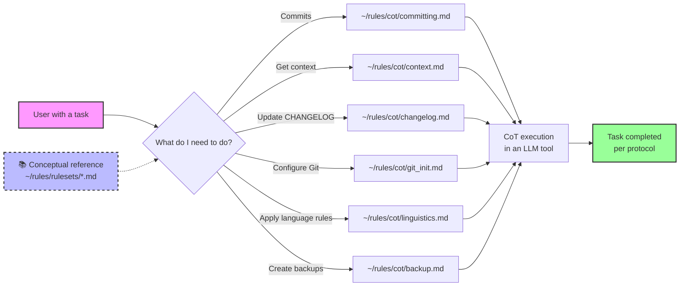
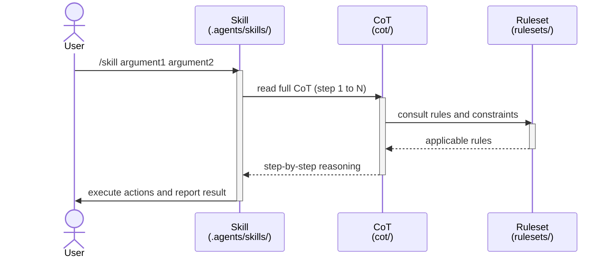

# Technical rules: prompts and CoTs to accelerate LLM context

*Last modified: 22 July 2026 (CST)*

[](https://www.gnu.org/licenses/gpl-3.0)
[](http://commonmark.org)
[-green.svg)](https://es.wikipedia.org/wiki/Espa%C3%B1ol_mexicano)
[](./cot/)
[](./.agents/skills/)
[](./rulesets/)

## Quick definitions

- *Prompt*: an instruction or context you give the model to indicate what to do, with which tone, and under which constraints.
- CoT (*Chain-of-Thought*): step-by-step reasoning that makes explicit how an answer is reached, especially useful for complex tasks.

This repository contains the rules, standards, and philosophy that guide technical work and collaboration in Rodrigo Álvarez's projects. In daily practice, CoTs are prioritised: documents describe the logic of the rules, but CoTs are the day-to-day operational tools.

## Core philosophy

A manifesto against three endemic issues in Latin American technology:

- **Mercenary work:** mediocre work without genuine commitment
- **Technical selfishness:** hoarding knowledge to create dependency
- **Identity loss:** cultural insecurities that reduce quality

### Related academic context

- The idea of using this repository as instructional context for LLMs aligns with the «chain-of-thought prompting» research line, which shows that providing reasoning chains improves performance on complex tasks.
- Reference: Jason Wei et al., «Chain-of-Thought Prompting Elicits Reasoning in Large Language Models», arXiv:2201.11903. DOI: [10.48550/arXiv.2201.11903](https://doi.org/10.48550/arXiv.2201.11903) (summary: [arXiv:2201.11903](https://arxiv.org/abs/2201.11903)).

## Daily workflow with CoTs (recommended)

Operational principle: documents in `rulesets/` contain logic and rules; however, day-to-day execution tools are CoTs located in `cot/`.

### Initial setup (one-time)

#### macOS and Linux

```bash
# 1. Clone the repository
git clone git@github.com:incogniaops/rules.git ~/rules

# 2. Install global skills and workflows (platform auto-detected)
~/rules/scripts/sync_global.sh
```

#### Windows (WSL)

```bash
# 1. Clone the repository (inside WSL)
git clone git@github.com:incogniaops/rules.git ~/rules

# 2. Install global skills and workflows
~/rules/scripts/sync_global.sh
```

#### Without cloning (remote execution)

```bash
# Install or update directly from the public repo
git clone git@github.com:incogniaops/rules.git ~/rules 2>/dev/null || git -C ~/rules pull
~/rules/scripts/sync_global.sh
```

**Notes**:

- `sync_global.sh` detects platform (macOS, Linux, Windows/WSL) and copies to correct locations:
  - *Skills* (`SKILL.md`): `~/.agents/skills/` (recognised by Warp, Claude, Cursor, Copilot, Gemini, and others)
  - *Workflows* (`*.yaml`) on macOS: `~/.warp/workflows/`
  - *Workflows* on Linux: `$XDG_DATA_HOME/warp-terminal/workflows/`
  - *Workflows* on Windows: `$APPDATA\\warp\\Warp\\data\\workflows\\`
- **Not copied** (accessed directly from `~/rules/`):
  - `scripts/` — `graph_auth.py` and other scripts
  - `templates/` — HTML templates and signature images
  - `rulesets/`, `cot/` — rules and reasoning chains
- To refresh after a `git pull`, just run: `~/rules/scripts/sync_global.sh`
- Symbolic links are not used; all paths are canonical (`~/rules/cot/`, `~/rules/rulesets/`)

### Daily usage



**Invocation examples**:

- `Apply ~/rules/cot/committing.md`
- `Apply ~/rules/cot/context.md`
- `Apply ~/rules/cot/changelog.md`

**Key principle**: always prioritise CoTs for execution; use `rulesets/` documents as conceptual references.

## Included documents

- **[PHILOSOPHY.md](./PHILOSOPHY.md)** - core philosophy and development manifesto
- **[FILOSOFIA.md](./FILOSOFIA.md)** - original Spanish philosophy source (English version derives from this baseline)
- **[AGENTS.md](./AGENTS.md)** - guide for AI agents working with this repository
- **[CORPORATE.md](./rulesets/CORPORATE.md)** - corporate professional profile
- **[TEACHING.md](./rulesets/TEACHING.md)** - educational and scientific outreach profile
- **[ATTRIBUTION.md](./rulesets/ATTRIBUTION.md)** - personal attribution rules
- **[COMMITTING.md](./rulesets/COMMITTING.md)** - rules for *commit* messages and change management
- **[GIT.md](./rulesets/GIT.md)** - initial setup for GitHub and GitLab accounts
- **[LICENSING.md](./rulesets/LICENSING.md)** - project licensing rules
- **[LINGUISTICS.md](./rulesets/LINGUISTICS.md)** - Mexican Spanish linguistic rules as the cultural reference
- **[LINGUISTICA.md](./rulesets/LINGUISTICA.md)** - original Spanish linguistics ruleset (English version derives from this baseline)
- **[STYLING.md](./rulesets/STYLING.md)** - style rules for Markdown documents (work projects)
- **[BACKUPS.md](./rulesets/BACKUPS.md)** - backup and destructive-operation policies
- **[GLOSSARY.md](./rulesets/GLOSSARY.md)** - glossary of technical terms used
- **[MAIL.md](./rulesets/MAIL.md)** - HTML email composition rules for OWA
- **[docs/MAIL.md](./docs/MAIL.md)** - sending email from CLI (owa/mac/graph modes, Graph API setup, *token* lifecycle)
- **[CHANGELOG.md](./CHANGELOG.md)** - project change history

## Technical specialisation

- DevOps engineering focused on cloud-native Kubernetes
- *Bare-metal* platforms on Proxmox VE
- GitOps and declarative automation
- Observability and service meshes
- Security in distributed environments

## Decision flow for applying rules

Most rules in this repository follow a **dual-context model** (personal vs work). The decision flow to determine which rules to apply is:

### 1. Project context identification

- 💼 **Work context**: projects developed for or under contract with **Elsevier (Tech Hub Ciudad de México / México City)**
- 📺 **Personal context**: independent, experimental, or personal-development projects

### 2. Rule application by context

| Aspect | Personal (`@incognia`) | Work (`@incogniaops`) |
|---------|------------------------|---------------------------|
| **Licensing** | GPLv3 (copyleft) | MIT (permissive) |
| **Authorship** | Rodrigo Álvarez (@incognia) | Rodrigo Álvarez (@incogniaops) |
| **Email** | [incognia@gmail.com](mailto:incognia@gmail.com) | [r.alvarez1@elsevier.com](mailto:r.alvarez1@elsevier.com) |
| **SSH Key (repos)** | ~/.ssh/incognia | ~/.ssh/elsevier |
| **SSH Key (servers)** | ~/.ssh/faraday | ~/.ssh/cad |
| **Document style** | Not defined yet | [STYLING.md](./rulesets/STYLING.md) applies |
| **Documentation language** | Mexican Spanish | International English |
| **CHANGELOG.md language** | Mexican Spanish | International English |
| **Code/commit language** | International English | International English |

### 3. Universal rules (apply to both contexts)

- **LINGUISTICS.md**: Mexican Spanish as cultural standard
- **COMMITTING.md**: Conventional Commits in English
- **PHILOSOPHY.md**: general working principles
- **BACKUPS.md**: backup and destructive-operation policies
- **GLOSSARY.md**: standardised technical terms
- **GIT.md**: repository initialisation setup

### 4. Dual-use rules (different application by context)

- **LICENSING.md**: defines which licence to use by context (personal: GPLv3, work: MIT)
- **CORPORATE.md**: professional profile adapted to each environment
- **TEACHING.md**: educational and outreach profile (personal context)

### 5. Personal-only rules

- **ATTRIBUTION.md**: personal attribution in individual documents/scripts

### 6. Work-only rules

- **STYLING.md**: style rules for corporate Markdown documents

## Architecture: *skills*, CoTs, and *rulesets*



- **Skill** (interface) — automatically discoverable entry point; defines *what to do* and receives arguments
- **CoT** (*middleware*) — step-by-step reasoning chain; defines *how to reason* to complete the task
- **Ruleset** (*backend*) — reference rules and constraints; defines *what is allowed and what is not*

## Repository structure

- **rulesets/** — reference rules and documentation (LINGUISTICS.md, COMMITTING.md, etc.)
- **cot/** — reasoning chains (CoT) for daily execution
- **templates/** — reusable templates
- **scripts/** — automation and backup scripts
- **.agents/skills/** — AI-agent discoverable *skills*:
  - `/aws-naming <source_path>` — normalise filenames for AWS/S3 naming workflows
  - `/commit` — full *commit* workflow with mandatory CHANGELOG
  - `/changelogger` — CHANGELOG.md maintenance with CST dates
  - `/bmail <type> <subject>` — generate corporate business email HTML from templates
  - `/linguistics <file>` — apply Mexican Spanish language rules
  - `/linguistica <file>` — alias of `/linguistics`
  - `/context` — quick project context detection
  - `/backup` — backup using standard naming
  - `/licensing` — automatic licensing (GPLv3 vs MIT)
  - `/git-init <personal|laboral> <key> <url> <branch>` — initialise repo with SSH
  - `/ssh-import <faraday|cad>` — import SSH key from GitHub into a server
  - `/mail <delivery|generic> <subject>` — compose OWA-compatible HTML email
  - `/release <semver>` — non-interactive release workflow with validation
  - `/kube <key> <user> <ip> <namespace>` — Kubernetes cluster analysis over SSH
  - `/kubetbs <key> <user> <ip> <namespace> [service]` — Kubernetes troubleshooting workflow
  - `/styling <hedgedoc|gitlab|github> [mit|gpl] <file>` — apply Kabat One style to a Markdown document
- **.warp/workflows/** — parameterised YAML commands (`Ctrl+Shift+R` in Warp):
  - `backup_file` — backup file/directory
  - `lint_markdown` — run *markdownlint*
  - `commit_flow` — `git add` + `git commit` with type and description
  - `cst_date` — get CST date/time

## Tools and scripts

- Synchronisation: scripts/sync_global.sh (installs global *skills* and *workflows*, cross-platform)
- Git (post-init): scripts/git-init-context.sh
- Backups:
  - scripts/backup_file.sh (files/directories, .tar.zst, *checksum* >=100 MB, CST log)
  - scripts/backup_rsync_snapshot.sh (daily incrementals with rsync --link-dest)
  - scripts/verify_backups.sh (bulk .sha256 verification)

## How to use CoTs quickly

- All CoTs: [cot/](./cot/) folder (25 files, including `_template.md`)
- Linguistics: [cot/linguistics.md](./cot/linguistics.md) + [LINGUISTICS.md](./rulesets/LINGUISTICS.md)
- Linguistica (original Spanish): [cot/linguistica.md](./cot/linguistica.md) + [LINGUISTICA.md](./rulesets/LINGUISTICA.md)
- *Commits*: [cot/committing.md](./cot/committing.md) + [COMMITTING.md](./rulesets/COMMITTING.md)
- Project context: [cot/context.md](./cot/context.md)
- CHANGELOG: [cot/changelog.md](./cot/changelog.md)
- HTML emails: [cot/mail.md](./cot/mail.md) + [MAIL.md](./rulesets/MAIL.md)

## Date/time conventions

- Format: 24-hour clock, «CST (México City)» zone.
- **CRITICAL**: Do not label UTC times as «CST» without conversion; CST = UTC - 6 hours.
- **Mandatory verification**: use `TZ=America/Mexico_City date` to get real time.
- Zone to use in scripts: TZ=America/Mexico_City.
- CHANGELOG.md: date only (YYYY-MM-DD), no time.

More details: see [LINGUISTICS.md – Dates and times (CST, México City)](./rulesets/LINGUISTICS.md).

### Command examples

```bash
# Date (CST) for CHANGELOG.md
TZ=America/Mexico_City date +"%Y-%m-%d"

# Readable date and time (CST)
TZ=America/Mexico_City date '+%F %H:%M %Z'
LC_TIME=es_MX.UTF-8 TZ=America/Mexico_City date '+%d de %B de %Y, %H:%M (%Z)'

# Verify correct conversion by comparing UTC vs CST
echo "UTC: $(date -u '+%H:%M')" && echo "CST: $(TZ=America/Mexico_City date '+%H:%M')"
```

UTC → CST conversion examples:

- UTC 14:30 → CST 08:30 (14 - 6 = 8)
- UTC 03:15 → CST 21:15 (previous day, 03 - 6 = -3, so 24 - 3 = 21)

## Usage

These documents serve as reference to maintain consistency in:

- technical working methodologies
- infrastructure and documentation standards
- licensing policies
- linguistic and cultural conventions
- correct application of rules based on project context

---

*This project was created by Rodrigo Álvarez (@incognia) and is distributed under the GPLv3 licence. For details, see the LICENSE file.*

*Copyright © 2026, Rodrigo Ernesto Álvarez Aguilera. This is free software under the terms of the GNU General Public License v3.*
