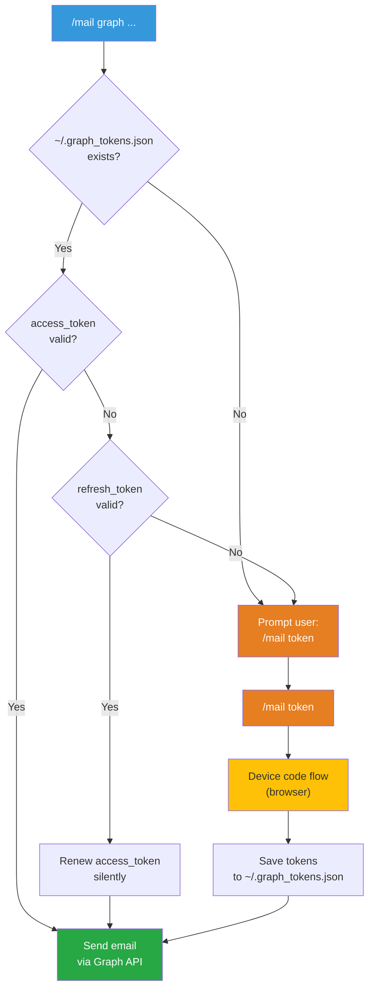

# Sending HTML email from the CLI

## Purpose

Documents the three available flows for composing and sending HTML emails from the terminal using the OWA templates in this repository. Each mode addresses a different scenario depending on the operating system and the desired level of automation.

## Sending modes

- **`owa`** — generates the HTML and saves it as a file. Open it in the browser, select all (Ctrl+A → Ctrl+C), and paste into the Outlook Web composition window. Works on any OS.
- **`mac`** — generates the HTML and opens a draft in Microsoft Outlook via AppleScript. Outlook injects the «Kabat One» signature automatically. Send with ⌘+Enter. macOS only.
- **`graph`** — generates the HTML and sends it directly via the Microsoft Graph API with OAuth2. Includes the signature as an *inline* image (CID). Works on any OS.

## Prerequisites

**All modes:**
- HTML templates in `~/rules/templates/mail/` (`delivery_template.html` and `generic_template.html`)
- Composition rules in `~/rules/rulesets/MAIL.md`

**`mac` mode (additional):**
- macOS with Microsoft Outlook installed and configured
- «Kabat One» signature set as the default signature in Outlook

**`graph` mode (additional):**
- Microsoft 365 account with an active mailbox (e.g. `ralvarez@kabatone.com`)
- Application registered in Microsoft Entra (see steps below)
- Python 3 and `curl` installed
- Signature image at `~/rules/templates/mail/assets/ralvarez_firma_740.png`
- Credentials in `~/.secrets.yaml` under the `GRAPH_API` key

---

## `owa` mode — copy and paste into Outlook Web

1. Generate the HTML using the appropriate template (delivery or generic)
2. Save the file as `YYYY-MM-DD-{short-name}.html` (CST date)
3. Copy the signature image alongside the HTML in an `assets/` subdirectory
4. Open the file in the browser
5. Select all (Ctrl+A), copy (Ctrl+C), and paste into the OWA composition window
6. Outlook Web appends the configured signature automatically on send

> **Note:** do not include the signature in the HTML; OWA injects it on its own.

---

## `mac` mode — draft in Outlook via AppleScript

1. Generate the HTML using the appropriate template
2. Save the file as `YYYY-MM-DD-{short-name}.html` (CST date)
3. Open a draft in Microsoft Outlook with AppleScript:

```applescript
tell application "Microsoft Outlook"
    activate
    set newMsg to make new outgoing message with properties {subject:"...", content:"..."}
    make new to recipient at newMsg with properties {email address:{address:"recipient@example.com"}}
    open newMsg
end tell
```

4. Outlook injects the «Kabat One» signature (with embedded image) automatically
5. Review the email and send with ⌘+Enter

> **Note:** do not include the signature in the HTML. Use `open` (not `send`) so that Outlook injects it. Sending directly with `send` does not add the signature.

---

## `graph` mode — direct send via Microsoft Graph API

### Container dimensions

- Outer table: `width="800"` with `max-width:800px`
- Inner `<td>` padding: 30px per side
- Usable content area: **740px** (800 − 30 − 30)
- The signature must be 740px wide to fill the usable area without overflow

### Signature

Microsoft Graph does not inject the signature configured in Outlook. You must include the signature image as an *inline* attachment with a `contentId` and reference it in the HTML with `cid:`:

- **File**: `~/rules/templates/mail/assets/ralvarez_firma_740.png` (740px wide)
- **Available variants**: `ralvarez_firma.png` (original), `_740.png`, `_800.png`, `_1024.png`

```html
<hr style="margin:30px 0; border:none; border-top:2px solid #ecf0f1;">

```

### Initial setup (one time only)

## Step 1: register the application in Microsoft Entra

1. Open [entra.microsoft.com](https://entra.microsoft.com) and sign in with your corporate account
2. Go to **Entra ID → App registrations → New registration**
3. Fill in the form:
   - **Name**: `Warp Mail CLI`
   - **Supported account types**: «Single tenant» (your organisation)
   - **Redirect URI**: leave blank
4. Click **Register**
5. Copy these values from the overview page:
   - **Application (client) ID**: your `CLIENT_ID`
   - **Directory (tenant) ID**: your `TENANT_ID`

## Step 2: add API permissions

1. In the registered application, go to **API permissions**
2. Click **Add a permission → Microsoft Graph → Delegated permissions**
3. Search for and add the following permissions:
   - `Mail.Send` — send email as the user
   - `email` — view the email address
   - `User.Read` — sign in and read the profile

All three permissions must appear as **Delegated** with **«No»** in the «Admin consent required» column.

## Step 3: enable public client flows

1. Go to **Authentication** in the application's left-hand menu
2. Open the **Advanced settings** tab
3. Enable **«Allow public client flows»** → **Enabled**
4. Click **Save**

> **Note:** if the toggle does not save correctly (`invalid_client` error on authentication), go to **Manifest**, find `"allowPublicClient"`, and change it to `true` manually.

## Step 4: authentication via device code flow

From the terminal, request a device code:

```bash
curl -s -X POST \
  "https://login.microsoftonline.com/$TENANT_ID/oauth2/v2.0/devicecode" \
  -d "client_id=$CLIENT_ID" \
  -d "scope=https://graph.microsoft.com/Mail.Send"
```

The response includes a `user_code` and a `device_code`. Open the URL shown (`https://login.microsoft.com/device`), enter the user code, and authenticate with your account.

Then exchange the `device_code` for an access token:

```bash
curl -s -X POST \
  "https://login.microsoftonline.com/$TENANT_ID/oauth2/v2.0/token" \
  -d "grant_type=urn:ietf:params:oauth:grant-type:device_code" \
  -d "client_id=$CLIENT_ID" \
  -d "device_code=$DEVICE_CODE"
```

The response contains an `access_token` (valid for approximately one hour) and a `refresh_token` for renewal.

## Step 5: send email via Microsoft Graph

Use the `/me/sendMail` endpoint with the obtained token:

```bash
curl -s -X POST "https://graph.microsoft.com/v1.0/me/sendMail" \
  -H "Authorization: Bearer $ACCESS_TOKEN" \
  -H "Content-Type: application/json" \
  -d '{
    "message": {
      "subject": "Email subject",
      "body": {
        "contentType": "HTML",
        "content": "<html><body>HTML content</body></html>"
      },
      "toRecipients": [
        {"emailAddress": {"address": "recipient@example.com"}}
      ],
      "attachments": [
        {
          "@odata.type": "#microsoft.graph.fileAttachment",
          "name": "ralvarez_firma.png",
          "contentType": "image/png",
          "contentBytes": "<BASE64_IMAGE_DATA>",
          "contentId": "firma_ralvarez",
          "isInline": true
        }
      ]
    },
    "saveToSentItems": true
  }'
```

In the email HTML, reference the signature as an *inline* image:

```html

```

---

## Registered application values

The `CLIENT_ID`, `TENANT_ID`, and other application parameters are stored in `~/.secrets.yaml` under the `GRAPH_API` key.

---

## Token lifecycle

The `scripts/graph_auth.py` script manages authentication with a cache at `~/.graph_tokens.json`.



### Periodicity

- **`access_token`**: expires in ~1 hour. Renewed automatically using the `refresh_token`.
- **`refresh_token`**: expires in ~90 days. When it expires, run `/mail token` again.
- **Daily use**: never prompts for authentication. The `refresh_token` is renewed each time it is used.
- **First use or after 90 days of inactivity**: run `/mail token` to re-authenticate.

### Files involved

- **`scripts/graph_auth.py`** — authentication logic (cache → refresh → device code)
- **`~/.graph_tokens.json`** — token cache (permissions 600, not versioned)
- **`~/.secrets.yaml`** — `CLIENT_ID` and `TENANT_ID` under the `GRAPH_API` key

---

## Technical notes

- **SMTP AUTH**: deprecated by Microsoft from 1 March 2026, with full disablement on 30 April 2026. The `graph` mode is the official replacement.
- **Signature per mode**: `owa` and `mac` delegate the signature to Outlook; `graph` includes it as an *inline* CID attachment.
- **HTML templates**: composition rules (inline styles, `bgcolor` on `<td>`, no external CSS) are in `rulesets/MAIL.md`.
- **Invocation**: use the *skill* `/mail <token|owa|mac|graph> <delivery|generic> <subject>`.

---

## References

- HTML composition rules: `~/rules/rulesets/MAIL.md`
- Composition and delivery CoT: `~/rules/cot/mail.md`
- *Skill*: `~/rules/.agents/skills/mail/SKILL.md`
- Authentication script: `~/rules/scripts/graph_auth.py`
- Templates: `~/rules/templates/mail/`

---

*Written by Rodrigo Álvarez (@incognia)*
