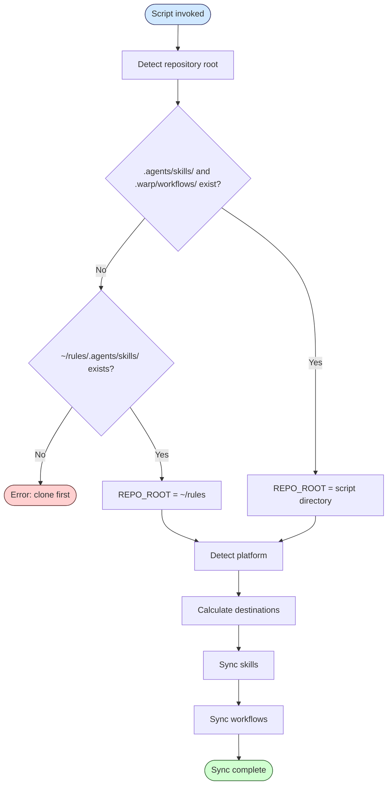
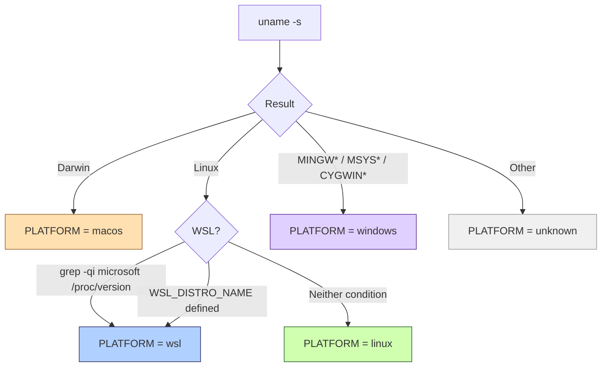
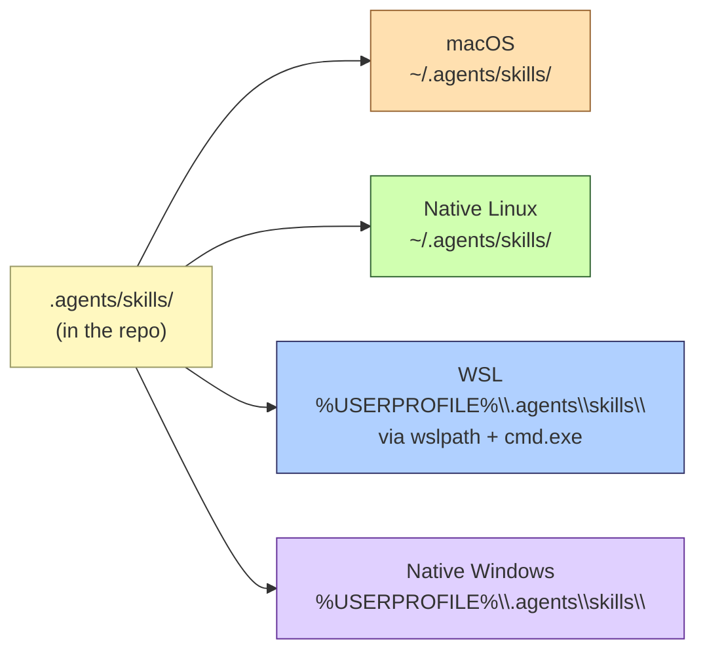
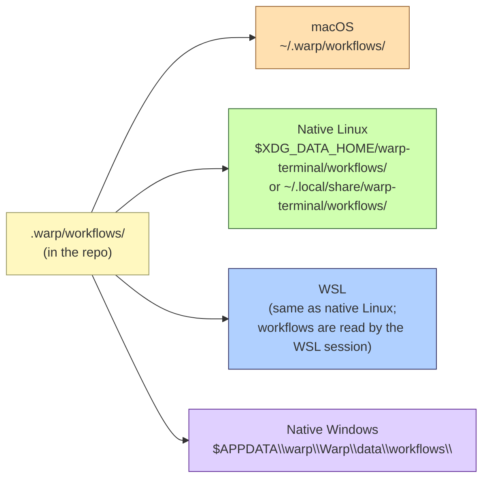
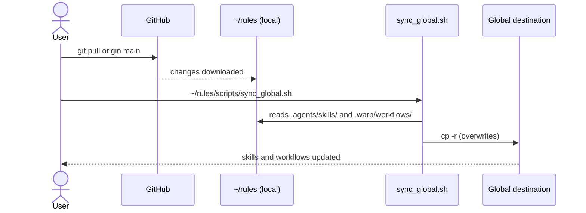

# Global synchronisation mechanism

*Last modified: 30 March 2026 (CST)*

This document describes in detail how `scripts/sync_global.sh` works: what it copies, where it copies to, how it detects the platform, and why each design decision exists.

## Purpose

Warp and other AI agents discover *skills* and *workflows* from fixed paths in the user's filesystem. The `rules` repository stores them under version control in `.agents/skills/` and `.warp/workflows/`, but those paths are only useful within the repository itself. `sync_global.sh` bridges that gap: it copies the artefacts to the global paths each tool and platform expects.

## What is synchronised and what is not

| Artefact | Synchronised? | Destination |
|----------|---------------|-------------|
| *Skills* (`.agents/skills/*/SKILL.md`) | Yes | Varies by platform (see table below) |
| *Workflows* (`.warp/workflows/*.yaml`) | Yes | Varies by platform (see table below) |
| `scripts/` | No | Accessed directly from `~/rules/scripts/` |
| `templates/` | No | Accessed directly from `~/rules/templates/` |
| `rulesets/` | No | Accessed directly from `~/rules/rulesets/` |
| `cot/` | No | Accessed directly from `~/rules/cot/` |

Artefacts that are **not** synchronised do not need to be on a global path because they are always referenced via canonical paths such as `~/rules/rulesets/X.md`.

## General execution flow



## Repository root detection

The script determines its location with:

```bash
SCRIPT_DIR="$(cd "$(dirname "$0")" && pwd)"
REPO_ROOT="$(cd "$SCRIPT_DIR/.." && pwd)"
```

This allows it to be invoked from any directory: both `./scripts/sync_global.sh` (from the repo root) and `~/rules/scripts/sync_global.sh` (from anywhere) produce the same result. If the calculated path does not contain the expected directories, it falls back to `~/rules`.

## Platform detection

Detection uses `uname -s` as the base, with a special case for WSL within the `Linux` branch:



The WSL/Linux separation is critical: although `uname -s` returns `Linux` in both cases, Warp runs on **Windows** inside a WSL environment and needs to read *skills* from the Windows filesystem, not the Linux one.

## Destinations by platform

### *Skills*

*Skills* must be in a path that Warp (or another agent) can discover globally. On WSL the Linux path (`~/.agents/skills/`) is invisible to Warp, so the destination is the Windows home directory:



On WSL, the Windows home directory is resolved at runtime:

```bash
WIN_HOME="$(wslpath "$(cmd.exe /C "echo %USERPROFILE%" 2>/dev/null | tr -d '\r')")"
SKILLS_DST="$WIN_HOME/.agents/skills"
```

`cmd.exe /C "echo %USERPROFILE%"` returns the Windows path (e.g. `C:\Users\incognia`), and `wslpath` converts it to the equivalent Linux path (`/mnt/c/Users/incognia`).

### *Workflows*

Warp *workflows* have different paths on each platform, dictated by operating system conventions:



> **Note on WSL and *workflows*:** unlike *skills*, *workflows* are synchronised to the Linux home because Warp loads them from the active WSL session, not from Windows.

## Copied structure

Each *skill* is a directory containing at least one `SKILL.md`. The script copies the entire directory, preserving any additional files (templates, helper scripts):

```text
.agents/skills/
├── commit/
│   └── SKILL.md          ← copied in full to $SKILLS_DST/commit/
├── changelog/
│   └── SKILL.md
├── context/
│   └── SKILL.md
└── ...
```

*Workflows* are flat YAML files copied directly to the destination directory:

```text
.warp/workflows/
├── backup_file.yaml       ← copied to $WORKFLOWS_DST/
├── commit_flow.yaml
├── cst_date.yaml
└── lint_markdown.yaml
```

## Update flow

After any `git pull`, re-running the script is sufficient. Because it uses `cp -r`, it overwrites existing files without needing to clean the destination manually:



## Invocation modes

```bash
# From the cloned repo root
./scripts/sync_global.sh

# From any directory (canonical path)
~/rules/scripts/sync_global.sh

# Without cloning — direct remote execution
bash <(curl -sL https://raw.githubusercontent.com/incognia/rules/main/scripts/sync_global.sh)

# Full update in a single command
git -C ~/rules pull && ~/rules/scripts/sync_global.sh
```

## Claude Code integration

After syncing skills to `~/.agents/skills/`, the script creates symlinks so that Claude Code can discover each skill as a slash command.

### How it works

For every skill directory found in `~/.agents/skills/`, the script creates a symlink:

```text
~/.claude/commands/<name>.md  →  ~/.agents/skills/<name>/SKILL.md
```

This means the skill's instruction file is not copied — it is linked. Any update to the skill (via `sync_global.sh`) is reflected immediately in Claude Code without a separate step.

### Paths

| Element | Path |
|---------|------|
| Source (skill file) | `~/.agents/skills/<name>/SKILL.md` |
| Destination (Claude Code command) | `~/.claude/commands/<name>.md` |

### Invocation in Claude Code

Once the symlinks exist, each skill is available as a slash command in Claude Code:

```text
/commit       →  runs the commit skill
/changelogger →  runs the changelogger skill
/linguistics  →  runs the linguistics skill
```

Skills can also be invoked programmatically via the `Skill` tool in the Claude Code agent.

## References

- Source script: [`scripts/sync_global.sh`](../scripts/sync_global.sh)
- Repository skills: [`.agents/skills/`](../.agents/skills/)
- Repository workflows: [`.warp/workflows/`](../.warp/workflows/)
- Initial setup: [`~/rules/README.md`](../README.md) — «Initial setup» section
